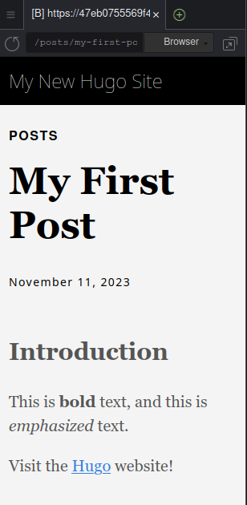
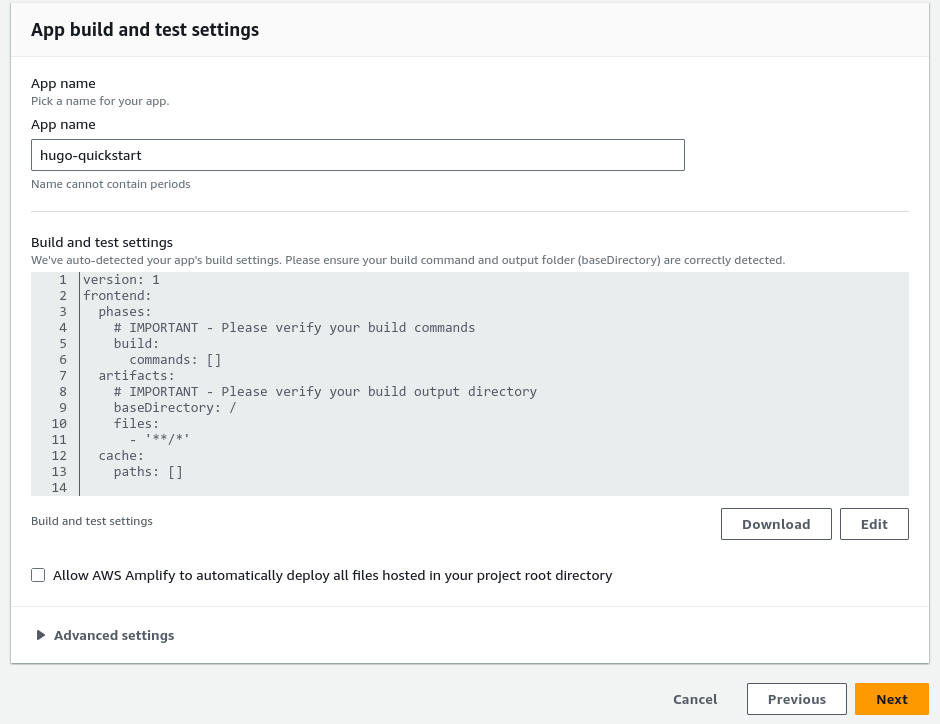

# Setting up a Static Blog on AWS Amplify

We will be using the `hugo` project to create a simple static HTML blog that we can upload to AWS Amplify.

AWS Amplify wraps S3 and CloudFront CDN in an easy service that hooks into your Git repo.

The following Workshop was developed using Cloud9, for the smoothest experience you should perform these actions from your Cloud9 IDE as well. Windows users continue at your own risk.


### Task 1

1.) Download Hugo from the latest Github release:

`wget https://github.com/gohugoio/hugo/releases/download/v0.120.4/hugo_extended_0.120.4_linux-amd64.tar.gz`

2.) We downloaded a `tar.gz` directory that is compressed. We must `untar` these files to install them.

`tar -xvf hugo_extended_0.120.4_linux-amd64.tar.gz`

The task output should look like this:

```
$ tar -xvf hugo_extended_0.120.4_linux-amd64.tar.gz
hugo
README.md
LICENSE

```

3.) Perform an `ls` command and note what color the `hugo` binary is. Does this binary have permissions to execute on your Cloud9 Instance?

4.) Move the `hugo` binary to `/usr/local/bin/` using the following command:

`sudo mv hugo /usr/local/bin`

5.) Test to ensure that `hugo` is showing up in your Cloud9 $PATH:

`hugo --help`

Your output should look similar to this:

```
$ hugo --help
hugo is the main command, used to build your Hugo site.

Hugo is a Fast and Flexible Static Site Generator
built with love by spf13 and friends in Go.

Complete documentation is available at https://gohugo.io/.

Usage:
  hugo [flags]
  hugo [command]

Available Commands:
  completion  Generate the autocompletion script for the specified shell
  config      Print the site configuration
  convert     Convert your content to different formats
  deploy      Deploy your site to a Cloud provider.
  env         Print Hugo version and environment info
  gen         A collection of several useful generators.
  help        Help about any command
  import      Import your site from others.
  list        Listing out various types of content
  mod         Various Hugo Modules helpers.
  new         Create new content for your site
  server      A high performance webserver
  version     Print Hugo version and environment info

Flags:
  -b, --baseURL string             hostname (and path) to the root, e.g. https://spf13.com/
  -D, --buildDrafts                include content marked as draft
  -E, --buildExpired               include expired content
  -F, --buildFuture                include content with publishdate in the future
      --cacheDir string            filesystem path to cache directory
      --cleanDestinationDir        remove files from destination not found in static directories
      --clock string               set the clock used by Hugo, e.g. --clock 2021-11-06T22:30:00.00+09:00
      --config string              config file (default is hugo.yaml|json|toml)
      --configDir string           config dir (default "config")
  -c, --contentDir string          filesystem path to content directory
      --debug                      debug output
  -d, --destination string         filesystem path to write files to
      --disableKinds strings       disable different kind of pages (home, RSS etc.)
      --enableGitInfo              add Git revision, date, author, and CODEOWNERS info to the pages
  -e, --environment string         build environment
      --forceSyncStatic            copy all files when static is changed.
      --gc                         enable to run some cleanup tasks (remove unused cache files) after the build
  -h, --help                       help for hugo
      --ignoreCache                ignores the cache directory
      --ignoreVendorPaths string   ignores any _vendor for module paths matching the given Glob pattern
  -l, --layoutDir string           filesystem path to layout directory
      --logLevel string            log level (debug|info|warn|error)
      --minify                     minify any supported output format (HTML, XML etc.)
      --noBuildLock                don't create .hugo_build.lock file
      --noChmod                    don't sync permission mode of files
      --noTimes                    don't sync modification time of files
      --panicOnWarning             panic on first WARNING log
      --poll string                set this to a poll interval, e.g --poll 700ms, to use a poll based approach to watch for file system changes
      --printI18nWarnings          print missing translations
      --printMemoryUsage           print memory usage to screen at intervals
      --printPathWarnings          print warnings on duplicate target paths etc.
      --printUnusedTemplates       print warnings on unused templates.
      --quiet                      build in quiet mode
      --renderToMemory             render to memory (only useful for benchmark testing)
  -s, --source string              filesystem path to read files relative from
      --templateMetrics            display metrics about template executions
      --templateMetricsHints       calculate some improvement hints when combined with --templateMetrics
  -t, --theme strings              themes to use (located in /themes/THEMENAME/)
      --themesDir string           filesystem path to themes directory
      --trace file                 write trace to file (not useful in general)
  -v, --verbose                    verbose output
  -w, --watch                      watch filesystem for changes and recreate as needed

Use "hugo [command] --help" for more information about a command.

```

6.) Let's create a new `hugo` site using the following commands:

```
hugo new site quickstart
cd quickstart
git init
git submodule add https://github.com/theNewDynamic/gohugo-theme-ananke.git themes/ananke
echo "theme = 'ananke'" >> hugo.toml
hugo server --port 8080

```

If successful, our output will look similar to this:

```
$ hugo server --port 8080
Watching for changes in /home/ec2-user/environment/quickstart/{archetypes,assets,content,data,i18n,layouts,static,themes}
Watching for config changes in /home/ec2-user/environment/quickstart/hugo.toml, /home/ec2-user/environment/quickstart/themes/ananke/config.yaml
Start building sites … 
hugo v0.120.4-f11bca5fec2ebb3a02727fb2a5cfb08da96fd9df+extended linux/amd64 BuildDate=2023-11-08T11:18:07Z VendorInfo=gohugoio


                   | EN  
-------------------+-----
  Pages            |  7  
  Paginator pages  |  0  
  Non-page files   |  0  
  Static files     |  1  
  Processed images |  0  
  Aliases          |  0  
  Sitemaps         |  1  
  Cleaned          |  0  

Built in 116 ms
Environment: "development"
Serving pages from memory
Running in Fast Render Mode. For full rebuilds on change: hugo server --disableFastRender
Web Server is available at http://localhost:8080/ (bind address 127.0.0.1) 
Press Ctrl+C to stop
```

On Cloud9, we can preview our application by clicking the `Preview` Button.


A small web browser will embed itself in your IDE like so:


7.) Make your first post:

`hugo new content posts/my-first-post.md`

If this command was successful, you should see similar output:

```
$ hugo new content posts/my-first-post.md

Content "/home/ec2-user/environment/quickstart/content/posts/my-first-post.md" created

```

Now you can navigate to `quickstart/content/posts/my-first-post.md` and we can get familiar with Markdown.

Our first post file looks like this:

```
+++
title = 'My First Post'
date = 2023-11-11T15:28:01Z
draft = true
+++

```

This type of data is generally called 'frontmatter'. These are details and metadata about your post that Hugo uses to create your static HTML files.

We can adjust the title of the post by editing the string after the equal sign on `title`, and we can make our draft published by changing the `true` to `false`. For right now, lets just start writing.

Change your text to look like this:

```

## Introduction

This is **bold** text, and this is *emphasized* text.

Visit the [Hugo](https://gohugo.io) website!

```

When you are done editing your post change `draft = false` in the frontmatter before deployment.

8.) Serve your content again with the following command:

 `hugo server --buildDrafts --port 8080`
 
If you were successful your preview pages should look like this:




9.) Edit the file `quickstart/hugo.toml` to change the Title of your site.

```
baseURL = 'https://example.org/'
languageCode = 'en-us'
title = 'My New Hugo Site' # <--- Change This Value!
theme = 'ananke'

```

## Task 2: Learning some Markdown

Markdown is a syntax for translating plain text files to HTML. Writing markdown is easier that writing HTML by hand.

Many programs exist to translate markdown syntax to HTML, and `hugo` is one of them.

If you were writing HTML and you wanted to write an H2 header, a paragraph, and a hyperlink we would have to type all of this:

```
<html>
<body>
<h2>This is my header</h2>
<p>This is my paragraph</p>
<a href="https://github.com">Github.com</a>
</body>
</html>

```
Notice that every HTML element needs opening and closing tags (the things sandwiching our words and links).

Writing HTML by hand can be error prone, because if you make a mistake and forget to close a bracket the whole page will look weird.

Lets compare this HTML with the markdown we wrote earlier:

```

## Introduction

This is **bold** text, and this is *emphasized* text.

Visit the [Hugo](https://gohugo.io) website!

```

Our H2 header just needs two hashes to tell hugo that we want an H2 header.

Let's look at different header sizes.

# This is an H1

`# This is an H1`

## This is an H2

`## This is an H2`

### This is an H3

`### This is an H3`

We can create bullets like this:

#### Unordered Bullets:

* Unordered bullet 1
* Unordered bullet 2
* Unordered bullet 3

```
* Unorderd bullet 1
* Unordered bullet 2
* Unordered bullet 3

```
#### Ordered Bullets:

1. Ordered bullet 1
2. Ordered bullet 2
3. Ordered bullet 3

```
1. Ordered bullet 1
2. Ordered bullet 2
3. Ordered bullet 3

```

Markdown is everywhere in development and engineering pages. Every Github README.md you see is written in markdown. Markdown makes the world go 'round.

This is not meant to be an exhaustive lesson on markdown, but if you would like to learn more about Github's markdown flavor visit: [https://docs.github.com/en/get-started/writing-on-github/getting-started-with-writing-and-formatting-on-github/basic-writing-and-formatting-syntax](Github markdown Basic Writing and Formatting Syntax).

We can update our first post with more markdown as a challenge. When you are ready with your site proceed to task 3.

## Task 3: Create a Github repo for your site

10.) Create a brand new Github repo for your Hugo site.

11.) Add your files to git to be tracked.

`git add *`

If successful your output your look like this with the command `git status`:

```
$ git status
On branch master

No commits yet

Changes to be committed:
  (use "git rm --cached <file>..." to unstage)
        new file:   .gitmodules
        new file:   archetypes/default.md
        new file:   content/posts/my-first-post.md
        new file:   hugo.toml
        new file:   resources/_gen/assets/css/ananke/css/main.css_83735de7ca999e9c17f3419b41b93fdb.content
        new file:   resources/_gen/assets/css/ananke/css/main.css_83735de7ca999e9c17f3419b41b93fdb.json
        new file:   themes/ananke

Untracked files:
  (use "git add <file>..." to include in what will be committed)
        .hugo_build.lock

```

12.) Commit your files:

`git commit -m "first commit"`

13.) Add the git remote:

HTTPS Remote (requires [Personal Access Token](https://docs.github.com/en/authentication/keeping-your-account-and-data-secure/managing-your-personal-access-tokens)): `git remote add origin https://github.com/your-github-user/your-repo-name.git`
SSH Remote (requires [SSH Keypair](https://docs.github.com/en/authentication/connecting-to-github-with-ssh/adding-a-new-ssh-key-to-your-github-account)): `git remote add origin git@github.com:your-github-user/your-repo-name.git`

14.) Push to Github:

`git push -u origin master`


```
$ git push -u origin master
Username for 'https://github.com/jlgore/hugo-quickstart.git': jlgore
Password for 'https://jlgore@github.com/jlgore/hugo-quickstart.git': 
Enumerating objects: 18, done.
Counting objects: 100% (18/18), done.
Delta compression using up to 2 threads
Compressing objects: 100% (9/9), done.
Writing objects: 100% (18/18), 15.20 KiB | 3.80 MiB/s, done.
Total 18 (delta 0), reused 0 (delta 0), pack-reused 0
To https://github.com/jlgore/hugo-quickstart.git
 * [new branch]      master -> master
branch 'master' set up to track 'origin/master'.

```
15.) Configure AWS Amplify


In the AWS Console search for "AWS Amplify" and click *Amplify Hosting | Host you web app*


16.) Click the GitHub button and then "Continue"


17.) Approve the GitHub integration


18.) Select your repo from the dropdown


19.) Edit the build settings to match this text (copy and paste if you need):

```
version: 1
frontend:
  phases:
    # IMPORTANT - Please verify your build commands
    build:
      commands: 
        - hugo
  artifacts:
    # IMPORTANT - Please verify your build output directory
    baseDirectory: /public
    files:
      - '**/*'
  cache:
    paths: []


```



20.) Edit the Package Override under *Advanced Settings* to Hugo


Click next after the edit.

21.) Click Build and Deploy

22.) Visit your site after the build is finished!


